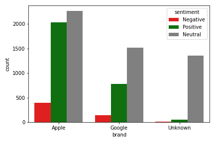
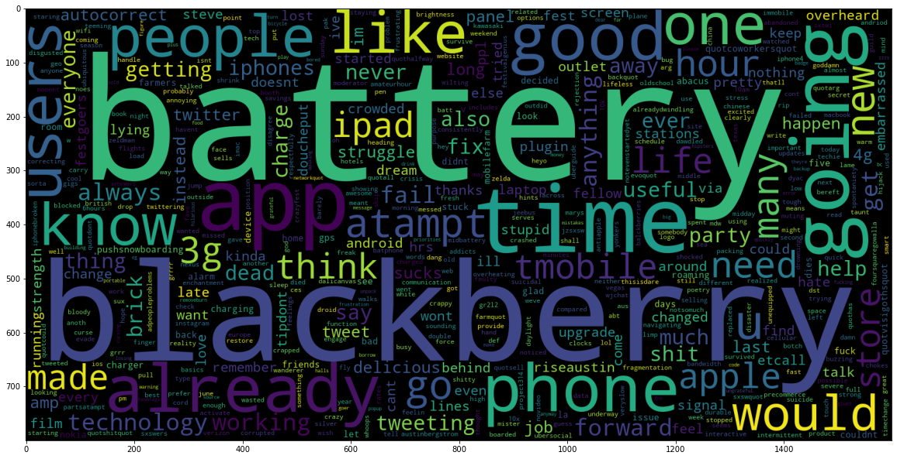

# Brands and Product Emotions

**Authors:** Kevin McDonough, Brad Horn, Ryan Reilly

## Overview

This project analyzes data for over 9,000 tweets about product reviews for Apple and Google. Human raters rated the sentiment as positive, negative, or neither. The goal of this analysis is to build an NLP model that will accurately predict the sentiment of a tweet based on the tweets text. This will be done through exploratory data analysis and iterative predictive modeling using classification models.

## Business Problem

Apple has hired us to predict the sentiment of tweets about their products. They will use our analysis to gather critical feedback about problems in newly released products. Based on our analysis, we are going to provide recommendations based on the following.

>Overall brand sentiment

>Product features that are called out in product mentions within negatvie tweets

>Reviewing what users are saying about the competition (Google)

## Data Understanding

Each row in this dataset represents a unique tweet made a by a user about an Apple or Google procduct. There are three columns in the dataset. Each feature and its description is listed below.

| Feature | Description|
|:-------| :-------|
|tweet_text| The full text of the tweet|
|emotion_in_tweet_is_directed_at| The product the tweet is directed at|
|is_there_an_emotion_directed_at_a_brand_or_product| The sentiment label of the tweet in 4 classes (positive, negative, neutral, and I can't tell|

Taking a look at the info of the dataset, there looks to be nulls in the product column which we will have to deal with. We also may need to convert the tweet column to a string to be used for analysis.

There are 4 classes for our target variable. There looks to be a good balance of no emotion(neutral) and postive tweets but there are few negative tweets so we will need to implement a re-sampling technique in our models. For those tweets that are labeld as "I can't tell", we will remove these rows from the dataset for our analysis and modeling.

## Data Preparation

### Missing Values

The first thing that we are taking care of are the missing values. The tweet column had one, being that we are going to be using the tweet to make prediction of this row holds no value to us so we are going to be droping it. The product column has 5,552 which is well over half are dataset. For this column, we impute the missing value as unknown. 

### Duplicates

Checking for row duplicates in the tweet column and found 22 of duplicates, these rows are romoved from the dataset as well.

### Classification Labels

The rows that have the "I can't tell" label are being removed. We don't think those rows don't really tell us anything and it wouldn't be helpful to predict. Finial we renamed the class lables:

| Original Name | New Name|
|:-------| :-------|
|Negative emotion| Negative|
|No emotion toward brand or product|Nuetral|
|Positive emotion| Positive|

## Feature Engineering

Creat a new column called that groups the products together by brand under a column for exploratory analysis.

## Exploratory Data Analysis

### What are the classes for the outcome?

### How are the length of the tweets distributed?

The average tweet length is around 120 characters.

### How many words are in the tweets?

There looks to be around 20 words.

### What are the most common stop words?

The most common stopwords are the, to, at, and for, which is not suprising.

### How are the sentiments for brand?

Apple looks to have more negative and nuetral tweets than Google.

### How many negative sentiments are there for each Apple mention?

The iphone and ipad look to have

## Preprocessing

We did a little preprocessing that we would need for modeling and some further EDA. We made a function that converts each tweet to lowercase, removes urls, hashtags and @ references, removes punctuation, removes stopwards, lemmatizes the words, and then joins the words back together. We used a label encoder to convert the classification label from strings to 0,1,2. Then did a train test split so we can have training and testing data. 

## Further EDA Wordclouds

After we preprocessed, we wanted to take a look at the wordclouds for negative tweets to highlight common words used to describe specific products.

### For negative tweets, how were users describing the iPad?

### For negative tweets, how were users describing the iphone?

### For negative tweets, how were users describing the Google?

### What words decribe the overall sentiment of postive tweets for Apple?

It looks like the Apple store gets mentioned a lot in these postive tweets about the company along with the mentions of the app, popup store, and ipad2.

## Modeling

### Dummy Model

The dummy model is showing that if we were to classify every tweet by the most common sentiment (neutral). We would be correct 61% of the time. This can definitley be improved upon through iterative model building.

### Baseline First Simple Model - Random Forest

#### Training Predictions

|scores| precision| recall| f1-score| support|
|:-------| :-------| :-------| :-------| :-------|
|negative| 0.99| 0.99| 0.99| 393|
|neutral| 0.99| 1.00| 0.99| 3581|
|positive| 1.00| 0.98| 0.99| 2008|
| | | | | |
|accuracy| | | 0.99| 5982|
|macro avg| 0.99| 0.99| 0.99| 5982|
|weighted avg| 0.99| 0.99| 0.99| 5982|

#### Testing Predictions

|scores| precision| recall| f1-score| support|
|:-------| :-------| :-------| :-------| :-------|
|negative| 0.65| 0.16| 0.26| 151|
|neutral| 0.70| 0.88| 0.78| 1561|
|positive| 0.65| 0.43| 0.52| 853|
| | | | | |
|accuracy| | | 0.69| 2565|
|macro avg| 0.67| 0.49| 0.52| 2565|
|weighted avg| 0.68| 0.69| 0.66| 2565|

We are focused on increasing the recall of the negative sentiment and on the baseline model the recall is 0.16.

### Models Using Hyperparameter Tuning and Pipelines

#### Naive Bayes

|scores| precision| recall| f1-score| support|
|:-------| :-------| :-------| :-------| :-------|
|negative| 0.20| 0.54| 0.30| 151|
|neutral| 0.78| 0.56| 0.65| 1561|
|positive| 0.50| 0.61| 0.55| 853|
| | | | | |
|accuracy| | | 0.57| 2565|
|macro avg| 0.49| 0.57| 0.50| 2565|
|weighted avg| 0.65| 0.57| 0.59| 2565|

#### Random Forest

|scores| precision| recall| f1-score| support|
|:-------| :-------| :-------| :-------| :-------|
|negative| 0.40| 0.28| 0.33| 151|
|neutral| 0.73| 0.80| 0.76| 1561|
|positive| 0.60| 0.53| 0.56| 853|
| | | | | |
|accuracy| | | 0.68| 2565|
|macro avg| 0.58| 0.54| 0.55| 2565|
|weighted avg| 0.67| 0.68| 0.67| 2565|

The overall accuracy looks to be better for the Random forest model when compared to the Naive Bayes model. While both models tend to do better in recall, Naive Bayes does considerably better than Random Forest. However, we feel that there is too much accuracy we are giving up by using the Naive Bayes Model. We will move forward with the random forest model. But first, we will try a Nueral Network model.

#### Neural Network

We also wanted to model using a Nueral Network to see if accuracy is improved.

|Class| Negative| Neutral| Positive|
|:-------| :-------| :-------| :-------|
|Negative| 127| 21| 3|
|Neutral| 889| 543| 129|
|Positive| 535| 172| 146|

|Score| Value|
|:-------| :-------|
|Precision:| 0.08188265635074146|
|Recall:| 0.8410596026490066|

While the accuracy of the Nueral Network improved, it did not do a good job of predicting any negative tweets. Thus we decided to chose the random forest model as our final model.

## Final Model Evaluation - Tuned Random Forest Model

### Final Model

|scores| precision| recall| f1-score| support|
|:-------| :-------| :-------| :-------| :-------|
|negative| 0.40| 0.28| 0.33| 151|
|neutral| 0.73| 0.80| 0.76| 1561|
|positive| 0.60| 0.53| 0.56| 853|
| | | | | |
|accuracy| | | 0.68| 2565|
|macro avg| 0.58| 0.54| 0.55| 2565|
|weighted avg| 0.67| 0.68| 0.67| 2565|

While our accuracy dipped from 0.69 in our baseline model to 0.68 in our tuned model, we did see a significant increase in our recall score. Our recall score increased from 0.16 to 0.28, an increase of 75%. This was the result of employing SMOTE, our resampling technique to create more observations of the negative class.

### Feature importance

|Name| Importance|
|:-------| :-------|
|link| 0.024860|
|sxsw| 0.018422|
|ipad| 0.017436|
|rt| 0.013566|
|iphone| 0.012953|
|apple| 0.011431|
|app| 0.008411|
|google| 0.008095|
|store| 0.007743|
|new| 0.006002|

#### What were the most important features in our tuned Random Forest Model?

It looks like the specific product names were good predictors as well as the conference it was held at and the brand name.

## Conclusions

#### 1. Overall brand sentiment. 
>By looking at both positive and negative tweets, Apple can see how users feel overall about the brand.

#### 2. Focus on features called out in product mentions within negatvie tweets.
>Iphone users were commenting a lot on the battery and iPad users were commenting on the design. These are informative in taking the next steps by following up with users to get more information on there tweets.

#### 3. Review what users are saying about the competition (Google). 
>By reveiwing what users are saying about other brands' products, this may help Apple with their brand.

## Next Steps

Further analyses could provide even more insight into how we can predict the sentiment of tweets:

#### Gather more tweets during that year: 
> This can be done by finding tweets from the same year (around 2013) that mention the same products. This could provide for better modeling. We could create a model with more balanced classes to better predict negative and positive tweets.

#### Get up to date tweets on similer products: 
> This can be done by finding tweets for the latest realease of the ipad, iphone, and Android devices. We could see how sentiment changes over time for products.

#### Gather data about products from similer companies: 
> There may be tweets about the latest samsung, t-mobile, LG, Motorola phones that we could compare.

