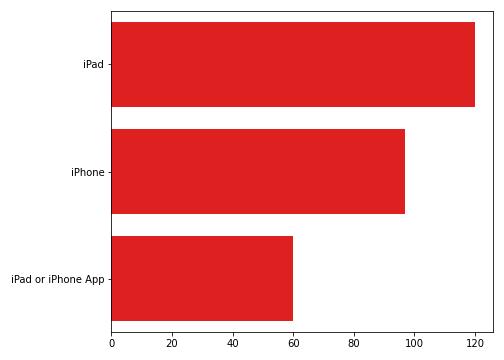

# Brands and Product Emotions

**Authors:** Kevin McDonough, Brad Horn, Ryan Reilly

## Overview

This project analyzes data for over 9,000 tweets about product reviews for Apple and Google. Human raters rated the sentiment as positive, negative, or neither. The goal of this analysis is to build an NLP model that will accurately predict the sentiment of a tweet based on the tweets text. This will be done through exploratory data analysis and iterative predictive modeling using classification models. 

## Business Problem

Apple has hired us to predict the sentiment of tweets about their products. They will use our analysis to gather critical feedback about problems in newly released products. Based on our analysis, we are going to provide recommendations based on the following.

- Which products to manage based on count of negative tweets
- What people say most often about certain products
- Identify compettion (Google) and see what is working best/worst

## Data Understanding

Each row in this dataset represents a unique tweet made a by a user about an Apple or Google procduct. There are three columns in the dataset. Each feature and its description is listed below.

| Feature | Description|
|:-------| :-------|
|tweet_text| The full text of the tweet|
|emotion_in_tweet_is_directed_at| The product the tweet is directed at|
|is_there_an_emotion_directed_at_a_brand_or_product| The sentiment label of the tweet in 4 classes (positive, negative, neutral, and I can't tell|

Taking a look at the info of the dataset, there looks to be nulls in the product column which we will have to deal with. We also may need to convert the tweet column to a string to be used for analysis.

There are 4 classes for our target variable. There looks to be a good balance of no emotion(neutral) and postive tweets but there are few negative tweets so we will need to implement a re-sampling technique in our models. For those tweets that are labeld as "I can't tell", we will remove these rows from the dataset for our analysis and modeling.

## Data Preparation

### Missing Values

The first thing that we are taking care of are the missing values. The tweet column had one, being that we are going to be using the tweet to make prediction of this row holds no value to us so we are going to be droping it. The product column has 5,552 which is well over half are dataset. For this column, we impute the missing value as unknown. 

### Duplicates

Checking for row duplicates in the tweet column and found 22 of duplicates, these rows are romoved from the dataset as well.

### Classification Labels

The rows that have the "I can't tell" label are being removed. We don't think those rows don't really tell us anything and it wouldn't be helpful to predict. Finial we renamed the class lables:

| Original Name | New Name|
|:-------| :-------|
|Negative emotion| Negative|
|No emotion toward brand or product|Nuetral|
|Positive emotion| Positive|

## Feature Engineering

Creat a new column called that groups the products together by brand under a column for exploratory analysis.

## Exploratory Data Analysis

### What are the classes for the outcome?

### How are the length of the tweets distributed?

The average tweet length is around 120 characters.

### How many words are in the tweets?

There looks to be around 20 words.

### What are the most common stop words?

The most common stopwords are the, to, at, and for, which is not suprising.

### How are the sentiments for brand?

Apple looks to have more negative and nuetral tweets than Google.

### How many negative sentiments are there for each Apple mention?

The iphone and ipad look to have

